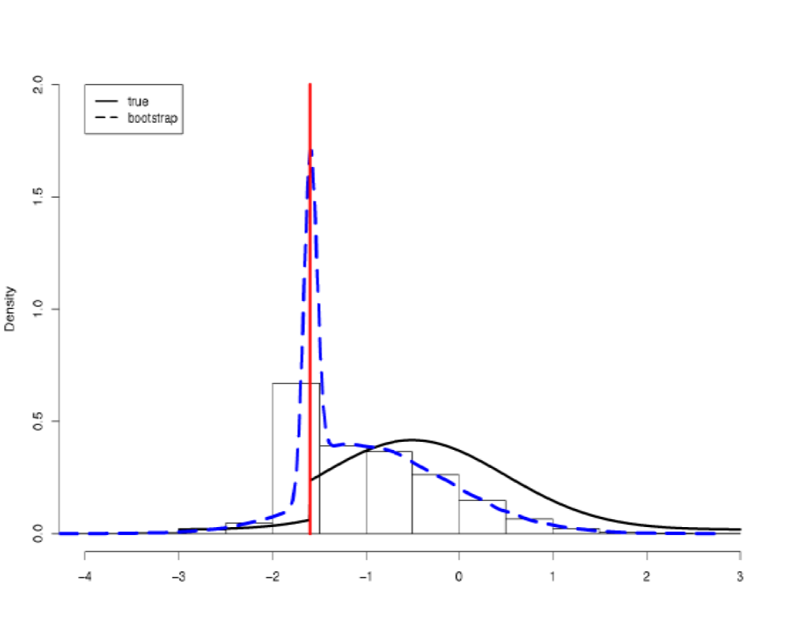

How to lasso: Least Absolute Shrinkage and Selection Operator
========================================================
author: Drew Altschul, Department of Psychology
date: 
autosize: true
transition: none

The Problem of Model Building
========================================================


- A while back, I was 

- can modern computing power improve model selection procedures?

- the lasso
  - shriking variable estimates to zero


What is the lasso?
========================================================

- Regularization method
- penalizes estimates 
  - reduce complexity
  - increase generalizability
- similar to ridge regression
  - but lasso can shrink to 0
  - and usually performs better
  
  
Features of the lasso
========================================================
- Estimates are biased due to penalization
  - Usually closer to the true mean
  - Does not produce standard errors


- Can fit data with more variables than observations
  - particularly good at this is a variant called the Elastic Net


Features of the lasso
========================================================



Working with the elastic net
========================================================
package 'glmnet'

```r
library(glmnet)
?glmnet
```

Variants
========================================================
* Mixed Models
  - `lmmlasso`
* Genomics
  - `LDlasso`
* Bayesian
  - `EBglmnet`
* Hazard models
  - `ahaz`
* Significant testing
  - `covTest`
  
***

* SEM
  - `regSEM`
  - `sparseSEM`
  - `qgraph`
* Variable, or rather, stability selection
  - `stabsel`
  - `c060`
  


Slide With Code
========================================================


```r
summary(cars)
```

```
     speed           dist       
 Min.   : 4.0   Min.   :  2.00  
 1st Qu.:12.0   1st Qu.: 26.00  
 Median :15.0   Median : 36.00  
 Mean   :15.4   Mean   : 42.98  
 3rd Qu.:19.0   3rd Qu.: 56.00  
 Max.   :25.0   Max.   :120.00  
```

Slide With Plot
========================================================


